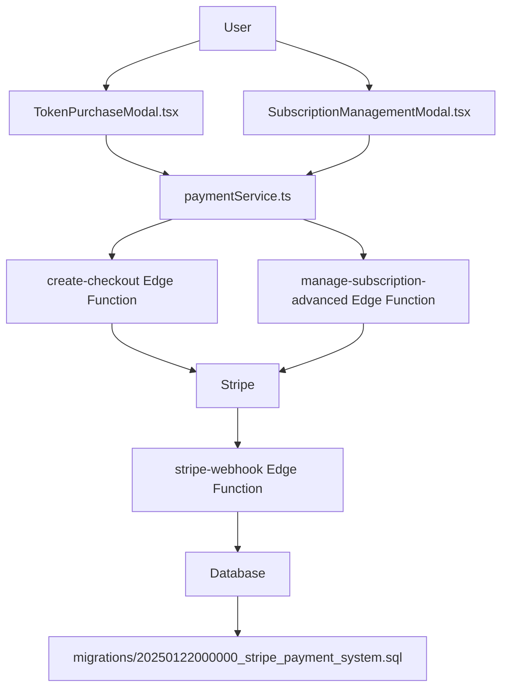

# 📂 Stripe Payment System - קבצים שנוצרו

מדריך מלא לכל הקבצים שנוצרו במערכת התשלומים.

---

## 🗂️ מבנה כללי

```
genie/
│
├── 📄 STRIPE_FILES_INDEX.md          ← אתה כאן!
├── 📄 STRIPE_SUMMARY.md               סיכום כללי של כל המערכת
├── 📄 STRIPE_QUICKSTART.md            מדריך התחלה מהירה (15 דקות)
├── 📄 STRIPE_INTEGRATION_README.md    מדריך מקיף מלא
├── 📄 STRIPE_TESTING_GUIDE.md         מדריך בדיקות מפורט
├── 📄 STRIPE_CHECKLIST.md             Checklist להדפסה
├── 🔧 setup-stripe.sh                 Script להתקנה אוטומטית
│
├── supabase/
│   ├── migrations/
│   │   └── 📊 20250122000000_stripe_payment_system.sql
│   │
│   └── functions/
│       ├── stripe-webhook/
│       │   ├── 📜 index.ts (עודכן)
│       │   └── ⚙️ deno.json (עודכן)
│       │
│       ├── create-checkout/
│       │   ├── 📜 index.ts (עודכן)
│       │   └── ⚙️ deno.json (עודכן)
│       │
│       └── manage-subscription-advanced/
│           ├── 📜 index.ts (חדש)
│           └── ⚙️ deno.json (חדש)
│
└── src/
    ├── services/
    │   └── 💼 paymentService.ts (חדש)
    │
    └── components/
        └── domain/
            ├── 🎨 TokenPurchaseModal.tsx (חדש)
            └── 🎨 SubscriptionManagementModal.tsx (חדש)
```

---

## 📚 Documentation Files

### 1. STRIPE_FILES_INDEX.md (הקובץ הזה)
**מטרה:** מדריך לכל הקבצים במערכת  
**קרא אותי:** כשאתה רוצה להבין מה כל קובץ עושה

### 2. STRIPE_SUMMARY.md
**מטרה:** סיכום מקיף של כל המערכת  
**קרא אותי:** כשאתה רוצה סקירה כללית של מה נבנה  
**תוכן:**
- מה נבנה?
- ארכיטקטורה
- מודל תמחור
- Queries שימושיות
- Next steps

### 3. STRIPE_QUICKSTART.md ⭐
**מטרה:** התחלה מהירה  
**קרא אותי ראשון!**  
**זמן:** 15 דקות  
**תוכן:**
- Checklist של 6 שלבים
- פקודות להעתקה
- בדיקה מהירה
- Everything you need to get started

### 4. STRIPE_INTEGRATION_README.md
**מטרה:** מדריך מקיף מלא  
**קרא אותי:** כשאתה רוצה להבין לעומק  
**תוכן:**
- ארכיטקטורה מפורטת
- הסבר על כל component
- API documentation
- Client integration
- Production deployment
- FAQ מקיף

### 5. STRIPE_TESTING_GUIDE.md
**מטרה:** בדיקות מקיפות  
**קרא אותי:** לפני שאתה עובר ל-production  
**תוכן:**
- 6 בדיקות מפורטות
- כרטיסי מבחן
- Troubleshooting
- Dashboard queries
- Full test scenarios

### 6. STRIPE_CHECKLIST.md
**מטרה:** Checklist להדפסה  
**קרא אותי:** סמן כל פעולה שהשלמת  
**תוכן:**
- Setup checklist
- Testing checklist
- Production checklist
- Post-launch checklist

---

## 🔧 Scripts

### setup-stripe.sh
**מטרה:** התקנה אוטומטית  
**שימוש:** `./setup-stripe.sh`  
**מה זה עושה:**
1. בודק prerequisites
2. מריץ migration
3. מעלה Edge Functions
4. בודק environment variables
5. מציג next steps

---

## 💾 Database Files

### migrations/20250122000000_stripe_payment_system.sql
**מטרה:** יצירת כל הטבלאות וה-functions ב-DB  
**גודל:** ~500 שורות  
**מה נוצר:**

**טבלאות:**
- `stripe_customers` - קישור users ל-Stripe
- `subscriptions` - מנויים
- `payments` - תשלומים
- `payment_notifications` - התראות
- `token_balance_history` - היסטוריה

**Functions:**
- `add_tokens_to_user()` - הוספת טוקנים
- `deduct_tokens_from_user()` - הפחתת טוקנים
- `subscribe_user()` - הפעלת מנוי
- `cancel_subscription()` - ביטול מנוי
- `reinstate_subscription()` - החזרת מנוי

**Views:**
- `user_payment_summary` - סיכום למשתמש

**Triggers:**
- Auto-create user_tokens
- Update timestamps

---

## ⚡ Edge Functions

### 1. stripe-webhook/
**Path:** `supabase/functions/stripe-webhook/`  
**URL:** `https://[PROJECT].supabase.co/functions/v1/stripe-webhook`  
**מטרה:** קבלה וטיפול ב-webhooks מ-Stripe

**מה זה עושה:**
- מקבל 9 סוגי אירועים
- מעדכן DB אוטומטית
- שולח נוטיפיקציות
- רושם היסטוריה

**אירועים:**
1. `checkout.session.completed`
2. `payment_intent.succeeded`
3. `payment_intent.payment_failed`
4. `invoice.payment_succeeded`
5. `invoice.payment_failed`
6. `customer.subscription.created`
7. `customer.subscription.updated`
8. `customer.subscription.deleted`
9. `charge.refunded`

**Helper Functions:**
- `sendPaymentFailureNotification()` - שליחת התראה
- `getOrCreateStripeCustomer()` - ניהול customers

### 2. create-checkout/
**Path:** `supabase/functions/create-checkout/`  
**URL:** `https://[PROJECT].supabase.co/functions/v1/create-checkout`  
**מטרה:** יצירת Stripe Checkout sessions

**Request Body:**
```typescript
{
  type: 'tokens' | 'subscription',
  amount?: number,        // לטוקנים
  priceId?: string,       // למנוי
  successUrl?: string,
  cancelUrl?: string
}
```

**Response:**
```typescript
{
  success: true,
  sessionId: 'cs_test_...',
  url: 'https://checkout.stripe.com/...'
}
```

### 3. manage-subscription-advanced/
**Path:** `supabase/functions/manage-subscription-advanced/`  
**URL:** `https://[PROJECT].supabase.co/functions/v1/manage-subscription-advanced`  
**מטרה:** ניהול מנויים מתקדם

**Actions:**
- `upgrade` - שדרוג
- `downgrade` - הורדת דרגה
- `reinstate` - החזרה
- `cancel_immediate` - ביטול מיידי
- `cancel_end_of_period` - ביטול בסוף תקופה

**Request Body:**
```typescript
{
  action: 'upgrade' | 'downgrade' | 'reinstate' | 'cancel_immediate' | 'cancel_end_of_period',
  newPriceId?: string,
  proration?: boolean
}
```

---

## 💻 Client-Side Files

### 1. paymentService.ts
**Path:** `src/services/paymentService.ts`  
**מטרה:** Service layer לכל פעולות התשלום  
**גודל:** ~350 שורות

**API:**
```typescript
// רכישת טוקנים
paymentService.purchaseTokens(amount: number)

// יצירת מנוי
paymentService.createSubscription(priceId: string)

// פתיחת Stripe checkout
paymentService.openCheckout(url: string)

// טיפול ב-callback
paymentService.handlePaymentCallback(url: string)

// ניהול מנוי
paymentService.manageSubscription(action, options)

// היסטוריה
paymentService.getPaymentHistory(limit)
paymentService.getTokenHistory(limit)

// מידע
paymentService.getActiveSubscription()
paymentService.calculateTokenPrice(amount)
paymentService.getSubscriptionTiers()
```

**תלויות:**
- `@supabase/supabase-js`
- `expo-linking`
- `expo-web-browser`

### 2. TokenPurchaseModal.tsx
**Path:** `src/components/domain/TokenPurchaseModal.tsx`  
**מטרה:** UI לרכישת טוקנים  
**גודל:** ~250 שורות

**Features:**
- 5 חבילות טוקנים (50-1000)
- אנימציות ו-transitions
- טיפול בשגיאות
- Loading states
- Popular badge
- מחשבון מחיר אוטומטי

**Props:**
```typescript
{
  visible: boolean;
  onClose: () => void;
  onSuccess?: () => void;
}
```

**שימוש:**
```tsx
<TokenPurchaseModal
  visible={showModal}
  onClose={() => setShowModal(false)}
  onSuccess={() => console.log('Success!')}
/>
```

### 3. SubscriptionManagementModal.tsx
**Path:** `src/components/domain/SubscriptionManagementModal.tsx`  
**מטרה:** UI לניהול מנויים  
**גודל:** ~450 שורות

**Features:**
- 2 מצבים: New subscriber vs Existing
- 3 tiers: Basic, Standard, Premium
- שדרוג/הורדת דרגה
- ביטול והחזרה
- הצגת מצב נוכחי
- Warning על ביטול מתוכנן
- Popular badge

**Props:**
```typescript
{
  visible: boolean;
  onClose: () => void;
  onSuccess?: () => void;
}
```

**Screens:**
- No subscription: בחירת תוכנית
- Active subscription: ניהול וביטול
- Scheduled cancellation: אפשרות להחזיר

---

## 🎯 איזה קובץ לקרוא תחילה?

### אם אתה...

**רוצה להתחיל מהר:**
1. 📄 `STRIPE_QUICKSTART.md`
2. 🔧 `setup-stripe.sh`
3. ✅ `STRIPE_CHECKLIST.md`

**רוצה להבין לעומק:**
1. 📄 `STRIPE_SUMMARY.md`
2. 📄 `STRIPE_INTEGRATION_README.md`
3. 📊 `migrations/20250122000000_stripe_payment_system.sql`

**רוצה לבדוק:**
1. 📄 `STRIPE_TESTING_GUIDE.md`
2. ✅ `STRIPE_CHECKLIST.md`

**מפתח frontend:**
1. 💼 `src/services/paymentService.ts`
2. 🎨 `src/components/domain/TokenPurchaseModal.tsx`
3. 🎨 `src/components/domain/SubscriptionManagementModal.tsx`

**מפתח backend:**
1. 📊 `migrations/20250122000000_stripe_payment_system.sql`
2. 📜 `supabase/functions/stripe-webhook/index.ts`
3. 📜 `supabase/functions/create-checkout/index.ts`

**DevOps:**
1. 🔧 `setup-stripe.sh`
2. 📄 `STRIPE_INTEGRATION_README.md` (Production section)
3. ✅ `STRIPE_CHECKLIST.md` (Production Readiness)

---

## 📊 סטטיסטיקות

**סה"כ קבצים שנוצרו/עודכנו:** 15

### קבצים חדשים (12):
- 📄 6 קבצי documentation
- 🔧 1 setup script
- 📊 1 migration
- 📜 1 Edge Function (manage-subscription-advanced)
- 💼 1 service
- 🎨 2 UI components

### קבצים שעודכנו (3):
- 📜 stripe-webhook/index.ts
- 📜 create-checkout/index.ts
- ⚙️ 2 deno.json files

**סה"כ שורות קוד:** ~2,500

**פילוח:**
- Documentation: ~1,200 שורות
- Database SQL: ~500 שורות
- Edge Functions: ~600 שורות
- Client Code: ~200 שורות

---

## 🔄 תלות בין קבצים



---

## 🎓 Learning Path

### Level 1: Beginner (30 דקות)
1. קרא `STRIPE_SUMMARY.md`
2. קרא `STRIPE_QUICKSTART.md`
3. הרץ `setup-stripe.sh`
4. עשה את הבדיקה המהירה

### Level 2: Intermediate (2 שעות)
1. קרא `STRIPE_INTEGRATION_README.md`
2. עבור על ה-Edge Functions
3. עבור על ה-migration
4. עשה בדיקה 1-3 מ-`STRIPE_TESTING_GUIDE.md`

### Level 3: Advanced (4 שעות)
1. עבור על כל ה-code
2. עשה את כל הבדיקות
3. התאם אישית את ה-UI
4. הוסף features נוספים

### Level 4: Production Ready (8 שעות)
1. הכן את Stripe Atlas
2. עבור ל-Live mode
3. הוסף Terms of Service
4. הגדר monitoring
5. Launch! 🚀

---

## 💡 Tips

### לפני שאתה מתחיל:
✅ וודא שיש לך גישה ל-Stripe Dashboard  
✅ וודא שיש לך Supabase project  
✅ התקן Supabase CLI  

### בזמן setup:
✅ תעתיק את כל ה-IDs (price_id, webhook secret, etc.)  
✅ שמור גיבוי של כל ה-secrets  
✅ בדוק את ה-logs אחרי כל שלב  

### בזמן בדיקות:
✅ תמיד השתמש ב-Test mode  
✅ בדוק את Stripe Dashboard אחרי כל פעולה  
✅ תעד כל בעיה שאתה מוצא  

### לפני production:
✅ עשה את כל הבדיקות  
✅ תכין Terms of Service  
✅ תגדיר monitoring  
✅ תעשה backup של DB  

---

## 🆘 עזרה

**לא מוצא משהו?**
- חפש ב-VSCode: `Cmd+Shift+F`
- חפש בקובץ זה: `Cmd+F`

**משהו לא עובד?**
1. בדוק logs: `supabase functions logs stripe-webhook --tail`
2. בדוק Stripe Dashboard > Webhooks > Events
3. קרא FAQ ב-`STRIPE_INTEGRATION_README.md`
4. קרא Troubleshooting ב-`STRIPE_TESTING_GUIDE.md`

**צריך להבין משהו לעומק?**
- קרא את ה-comments בקוד
- קרא את הדוקומנטציה הרלוונטית
- בדוק דוגמאות ב-`STRIPE_TESTING_GUIDE.md`

---

## ✨ Summary

יצרנו מערכת תשלומים **מלאה ומקצועית** ש:

✅ תומכת ברכישת טוקנים ומנויים  
✅ מטפלת בכל זרימות התשלום  
✅ כוללת UI מלא ונוח  
✅ מתועדת לעומק  
✅ מוכנה ל-production  

**כל הקבצים במקום אחד. כל הכלים שאתה צריך. זמן לבנות! 🚀**

---

*Created: January 22, 2025*  
*GenieAI Payment System v1.0*

